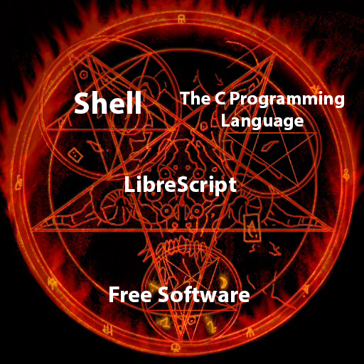

# Documentation


- Getting Started
  - [Hello World](#hello-world)
- References
  - [Variables](#variables)
    - [Smug construct](#smug-construct)
    - [Data types and size](#data-types-and-size)
  - [Operators](#operators)
    - [Arithmetic](#arithmetic)
    - [Logical](#logical)
  - [Special constructors](#special-constructors)
    - [@clang](#clang)
    - [@shell](#shell)
  - [Imports](#import)
  - [Comments](#comments)
  - [Conditional statements](#conditional-statements)
  - [Functions](#functions)

## Hello World
First create a file with `.libre` extension, we will create the `hello.libre`.\
LibreScript doesn't have your own stdio yet but you can use the [@clang](#clang) constructor to use C stdio functions:
```
import stdio.h;


string hello :3 'Hello, world!';

@clang
  printf("%s", hello);
@end
```
first we need to import the stdio library
`import stdio.h;`
after that we will declare a string type [variable](#variables) using [:3](#smug-construct)\
`string hello :3 'Hello, world!';`\
now for call the printf function we must use the @clang operator to use C code, don't forget to signal when the C code ends with @end.
```
@clang
  printf("%s", hello);
@end
```
for compile your LibreScript file use:\
`ancap hello.libre`\
output:\
`Hello, world!`

## Variables
Variables in LibreScript variables have permanent values.\
Global variables are generally declared using the smug construct (:3):
```
string hello :3 'Hello, world!';
bool var :3 true;
```

## Smug construct
Smug construct is used to variables assignment.\
`int8 var :3 123;`\


## Data types and size

|  Type  |     Byte Size     |
|:------:|:-----------------:|
|  int8  |         1         |
|  int16 |         2         |
|  int32 |         4         |
|  int64 |         8         |
|  uint8 |         1         |
| uint16 |         2         |
| uint32 |         4         |
| uint64 |         8         |
|  size  |         2         |
|  char  |         1         |
| string | (1 * string size) |
|  bool  |         1         |
|  float |         4         |
| double |         8         |

## Operators
Operators in LibreScript

## Arithmetic

| Type | Operator |
|:----:|:--------:|
|  Sum |     +    |
|  Sub |     -    |
| Mult |     *    |
|  Div |     /    |

## Logical

|   Type  | Operator |
|:-------:|:--------:|
|    Or   |    ||    |
|  OrNot  |    !=    |
|  Equal  |    ==    |
| Greater |     >    |
|   Less  |     <    |

## Special constructors
For now LibreScript only have two special constructors.\
All special constructors need @end signal when the construct coding ends.

## @clang
@clang allows C coding.\
The content is compiled with LibreScript code.
```
@clang 
  for (size_t i = 0; i < 10; ++i)
      printf("Hello, World\n");
@end
```

## @shell
@shell allows shell coding.\
This create a new shell file with the content, to run you need to call it.
```
@shell :name_of_script 
  echo "Hello, World!"
@end
```
you can only call the shell coding after your content declaration with:\
`$name_of_script`

## Import
For import external libs in your main file you need to import at the beginning of the file:\
`import name_of_file.libre;` \
now you can use the name_of_file.libre lib

## Comments
Use /* and */ for create comments on your code

```
/* variable declaration */
string hello :3 'Hello, world!';
```

## Conditional statements
if "conditionals" [
  code...
] elif "conditionals" [
  code...
] else [
  code...
]

```
if "var > var2" [
  @clang
    printf("var > var2");
  @end
] elif "var2 > var3" [
  @clang
    printf("var2 > var3");
  @end
] else [
  @shell :else
    echo "else"
  @end
  $else
]
```

## Functions
`eu ainda nao fiz isso` 